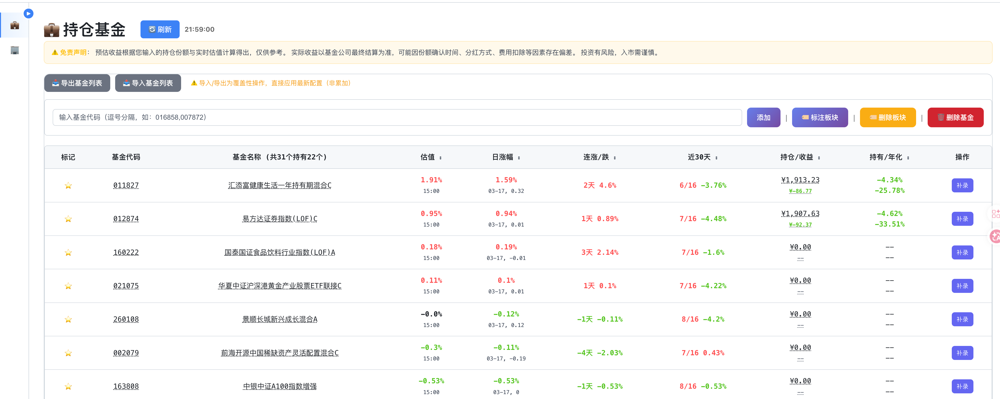

# FundEval - 基金交易与收益评估工具

FundEval 参考LanFund继续演进，定位为“可交易记录、可收益评估、可视化对比”的基金工具。
支持终端和 Web 两种使用方式，默认通过 Web 页面（8311 端口）进行日常操作，以web为演进方向。


---

## ✨ 最新功能

- 🧾 **交易闭环**：支持补录买入、卖出交易
- 📈 **收益升级**：支持持有收益 + 年化收益双指标，支持累计收益曲线查看（点击“收益”）
- 🧭 **业绩对照**：基金业绩曲线叠加沪深300基准
- 🔵🔴 **交易点可视化**：业绩图展示买入/卖出点位
- 🏷️ **持仓管理增强**：星标、份额、板块、导入导出联动
- 
---

## 功能特性
### 基础数据能力

- 基金增删改查
- 板块标注/取消
- 导入导出基金列表

---

## 💡 使用建议

**推荐工作流程**：

1. **Web 端首次配置**
   - 访问 `http://localhost:8311` 注册/登录
   - 添加基金、设置份额、标记持有、配置板块

2. **日常操作**
   - 优先在 Web 端进行买入/卖出/补录与收益查看
   - 按需导出基金列表用于备份或迁移

---

## 安装

### 依赖安装

```bash
pip install -r requirements.txt
```

### 依赖包说明

- `loguru` - 日志输出
- `requests` - HTTP请求
- `tabulate` - 表格格式化
- `flask` - Web服务器（仅Web模式需要）
- `curl-cffi` - 浏览器模拟请求
- `langchain` - AI提示链框架（AI分析功能）
- `langchain-openai` - OpenAI兼容API支持
- `langchain-core` - LangChain核心组件

---

## 使用方法

### Web 服务器模式

#### 启动服务

```bash
python fund_server.py
```

默认地址：`http://localhost:8311/portfolio`

#### Web 操作功能

- 添加/删除基金
- 补录买入/卖出交易
- 标记持有与设置份额
- 标注板块
- 导入导出基金列表
- 查看收益与业绩图

---

## 差异说明（基于近期提交）

以下为相对蓝Fund的功能变化摘要（按产品功能聚合）：

### 1) 交易能力增强

### 2) 收益展示升级

- 收益列升级为“持有/年化”
- 持续收益跟踪
- 收益展示随交易与持仓自动更新

### 3) 图表能力增强

- 业绩图加入沪深300对照
- 图上叠加买入/卖出点
- 显示最新净值与净值日期

### 4) 交互与体验优化

- 数据自动获取、填入
- 补录日期支持自动尝试回填净值
- 颜色、图例、点样式等做了多轮可读性优化

---

## 注意事项

- 本项目为个人投资辅助工具，不构成投资建议
- 外部行情数据可能波动，请以基金公司最终结算为准
- 建议定期导出基金列表进行备份
