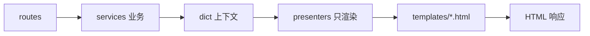
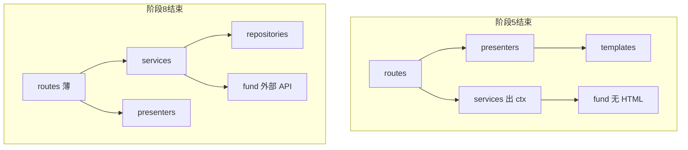

# FundEval 重构方案（优化版 v4）

> 创建日期：2026-05-22  
> 最后更新：2026-05-22  
> 范围：Web 主流程 + database 仓储 + fund_server 业务拆分；**HTML/模板与 Python 业务分离**  
> 静态资源：迁入 `src/static`、`src/templates`  
> **范围外**：`ai_analyzer`（主流程未使用，文件保持不动）  
> **阶段编号 0–11 与执行顺序、PR 顺序一致**

与初版 [README.md](README.md) 的差异说明见 README；**执行以本文件为准**。

---

## 代码库现状快照

| 指标 | 数值 | 说明 |
|------|------|------|
| `fund_server.py` | 4648 行 | 52 路由 + **51** 个 `_` 前缀私有函数 |
| `importlib.reload(fund)` | **27** 处 | 均在 `fund_server.py`，阶段 4 清零 |
| `src/fund.py` | 2895 行 | `MiniFund` + **`python src/fund.py` CLI** 入口 |
| `src/module_html.py` | 5810 行 | 其中 `get_css_style`≈994 行、`get_javascript_code`≈1540 行 |
| 根目录 `static/css/style.css` | 2053 行 | 与 module_html 内联 CSS **重复** |
| 根目录 `static/js/main.js` | 4149 行 | 页面已外链 JS，部分路径仍内联注入 |
| `src/database.py` | 1444 行 | **40** 个公开方法，路由层大量直连 `db` |
| `src/ai_analyzer.py` | 1510 行 | **范围外**：仅 CLI `--with-ai`，Web 无引用 |
| 自动化测试 | **0** | `requirements.txt` 无 pytest |
| 已用 SSR 页面 | **2** | `/portfolio`、`/sectors` |
| 已用 Jinja 页 | **2** | `/login`、`/register` |
| 废弃 SSR | 0 引用 | `get_full_page_html*`、`dashboard.html` |

---

## 与初版 README 方案的校正

| 问题 | 初版 README | 实际代码 |
|------|-------------|----------|
| `bk_map` 位置 | `module_html.py` | `src/fund.py` ~1713 行 |
| 板块命名 | `SECTOR_CATEGORIES` | `MAJOR_CATEGORIES` |
| 前端 | 新建 `src/static` | 根目录已有 static，且 **双份加载** |
| 业务重心 | 主要抽 `fund.py` | **`fund_server.py` 私有函数才是主战场** |
| XIRR | 只抽 `fund.py` | `fund.py` 与 `fund_server.py` **各一套** |
| 模板化 | 侧边栏整页 | `get_full_page_html_sidebar` **无引用**，阶段 1 删除 |
| AI | 与 Web 并列 | **不在本次范围** |

---

## 核心原则：展示与逻辑分离

**目标**：Python 只负责取数、算指标、组装 **dict/列表**；所有 HTML（整页、Ajax 片段）由 **Jinja 模板** 渲染。



| 层级 | 职责 | 禁止 |
|------|------|------|
| `routes/` | 参数校验、调 service/presenter、返回响应 | 拼接 HTML 字符串 |
| `services/` | 业务规则、DB/外部 API、返回结构化数据 | `render_template`、含 HTML 标签 |
| `presenters/` | `render_template` / `render_partial` | 访问数据库、复杂计算 |
| `templates/` | 布局、表格、模态框、图表容器 | 业务逻辑 |

**模板目录约定**：

```
src/templates/
├── layouts/base.html
├── pages/portfolio.html
├── pages/sectors.html
├── partials/fund_table.html
├── partials/fund_row.html
├── tabs/kx.html
└── components/modal.html
```

| 现状 | 目标 |
|------|------|
| `get_portfolio_page_html()` 巨型 f-string | `pages/portfolio.html` + partials |
| `fund.MiniFund.fund_html()` 返回 HTML | `build_portfolio_context()` → presenter |
| `/api/tab/<id>` 返回 `*_html()` 字符串 | `render_template('tabs/xxx.html', **ctx)` |
| `enhance_fund_tab_content()` | 份额等写入 ctx，模板展示 |
| `module_html.py` | **阶段 5.4 删除**（见门禁） |

---

## `fund.py` 与 `fund_server.py` 边界（避免双轨）

| 时点 | `fund_server.py` | `fund.py`（`MiniFund`） |
|------|------------------|------------------------|
| **阶段 5 结束时** | 不再 `import module_html`；Tab/页面走 presenter | **删除全部 `*_html`** |
| **阶段 8 结束时** | 业务在 `services/*`；reload 已在阶段 4 为 0 | service 只调 **数据方法** 或 `market_service` |
| **阶段 9** | — | 仅 HTTP 客户端、缓存、`run()` CLI |
| **阶段 10** | Blueprint | 与 Web 解耦 |

**禁止**：阶段 8 的 service 仍调 `fund.fund_html()` 同时又用 `fund_table.html` 模板（双套实现）。阶段 5 必须先切 HTML 路径。



---

## 三类运行面

| 运行面 | 入口 | 输出 | 阶段 |
|--------|------|------|------|
| SSR | `/portfolio`, `/sectors` | 完整 HTML | **5** |
| API | `/api/*` | JSON | **8** |
| Tab 片段 | `/api/tab/<id>` | HTML 片段 | **5** |
| CLI | `python src/fund.py` | 终端 | 不破坏 `run()`；**不迁 AI** |

---

## 死代码清单（阶段 1 删除，零功能风险）

| 符号 | 约行数 | 原因 |
|------|--------|------|
| `get_full_page_html*` | ~300 | 路由已重定向 `/portfolio` |
| `get_sse_loading_page` 等 | ~560 | 仅死路径互调 |
| `get_css_style` / `get_javascript_code` | ~2534 | 阶段 3 与 static 去重后删 |
| `templates/dashboard.html` | 87 | 无引用 |

**阶段 1 后保留**：`get_portfolio_page_html`、`get_sectors_page_html`、`get_table_html`、`enhance_fund_tab_content`（阶段 5 前删）。

---

## 目标目录结构

```
FundEval/
├── run.py
├── requirements.txt
├── requirements-dev.txt          # 阶段 0
├── config.yaml
├── src/
│   ├── web/
│   │   ├── app.py
│   │   ├── extensions.py
│   │   └── lan_fund_session.py   # 阶段 4：get_lan_fund
│   ├── config/
│   ├── data/
│   ├── models/
│   ├── repositories/
│   ├── services/
│   ├── presenters/
│   ├── routes/
│   ├── utils/
│   ├── templates/
│   ├── static/
│   ├── cli/main.py               # 阶段 9
│   ├── database.py
│   ├── fund.py
│   ├── module_html.py            # 阶段 5.4 删除
│   └── ai_analyzer.py            # 范围外
└── docs/refactor/
```

---

## fund_server.py 路由分域（52 个）

| 域 | 路由数 | 目标 |
|----|--------|------|
| auth | 3 | `routes/auth` |
| 页面 | 2+4 重定向 | `routes/pages` + presenters |
| 基金 CRUD | 16 | `fund_service` |
| 交易 | 14 | `transaction_service` + `metrics` |
| 图表/净值 | 5 | `chart_service` + `nav_service` |
| 行情 Tab | 9 | `market_service` + presenters |
| 其它 | 3 | 配置/板块 |

---

## database.py → repositories（阶段 7）

| Repository | 职责规模 |
|------------|----------|
| `user_repo` | 小 |
| `fund_repo` | 中 |
| `transaction_repo` | 大 |
| `nav_repo` | 大 |

**阶段 7 顺序**：`user` → `fund` → `transaction` → `nav`（后两者耦合最高，放最后）。

---

## 分阶段执行计划

> 编号 **0–11** = 执行顺序 = PR 主序列（阶段 5、7、8 可拆多个 PR）。

### 阶段 0：回归基线（1 天）

- [x] [`docs/refactor/checklist.md`](checklist.md)（P0/P1/P2 操作步骤与通过标准）
- [ ] `requirements-dev.txt`：`pytest>=8`
- [ ] `tests/test_financial.py`、`tests/test_trading_calendar.py`
- [x] [`docs/refactor/fixtures/`](fixtures/)：`api_fund_data.json`、`api_performance_chart_data.json`

**Checklist**：

- **P0（每 PR）**：登录 → 持仓 → 增删基金 → 买卖 → 业绩曲线 → 登出
- **P1（阶段 5+）**：`/sectors`、`/api/tab/fund`
- **P2（阶段 8+）**：导入、交易补录
- **范围外**：`--with-ai`

---

### 阶段 1：死代码删除（1 天）— PR #2

1. 删除 `get_full_page_html*`、`get_sse_loading_page`、旧 sidebar/卡片等
2. 删除 `templates/dashboard.html` → [decisions/002-remove-legacy-dashboard.md](decisions/002-remove-legacy-dashboard.md)
3. **验收**：`wc -l src/module_html.py` ≤ **2600**；P0 通过

---

### 阶段 2：数据与配置（2 天）— PR #3

- `src/data/sectors.py`、`src/data/bk_map.py`
- `src/config/settings.py`（不重复 `yaml_config`）
- `fund.MAJOR_CATEGORIES` 临时 re-export，**阶段 8 后**删除

---

### 阶段 3：静态资源迁移与去重（2–3 天）— PR #4

1. `static/`、`templates/` → `src/static`、`src/templates`
2. 删除 `get_css_style`、`get_javascript_code` 及 `{css_style}` 注入
3. Flask `template_folder` / `static_folder` 指向 `src/`

**验收**：无重复 CSS/JS；`module_html` ≤ **2500** 行；**JS 去重** `rg "get_javascript_code" src/` → **0**；P0 通过

---

### 阶段 4：MiniFund 请求单例（1 天）— PR #5

**目标**：27 处 `importlib.reload(fund)` → `get_lan_fund(user_id)`（[ADR-003](decisions/003-flask-g-lanfund-singleton.md)）

```python
def get_lan_fund(user_id: int) -> MiniFund:
    if "lan_fund" not in g:
        g.lan_fund = MiniFund(user_id=user_id, db=current_app.extensions["db"])
        g.lan_fund.load_cache()
    return g.lan_fund
```

**门禁**：`rg "importlib\.reload" fund_server.py | wc -l` → **0**

---

### 阶段 5：展示层分离（5–7 天）— PR #6–9

**5.1 基础设施（1 天）**

- `src/presenters/`、`layouts/base.html`
- `render_page` / `render_tab` 统一入口

**5.2 整页 SSR（2 天）**

| 页面 | 模板 |
|------|------|
| `/portfolio` | `pages/portfolio.html` + `partials/fund_table.html` |
| `/sectors` | `pages/sectors.html` + partials |

**5.3 全部 `*_html` + Tab（2–3 天）**

| `fund.py` 方法 | 模板 |
|----------------|------|
| `fund_html` | `partials/fund_table.html` |
| `marker_html` | `tabs/marker.html` |
| `gold_html` / `real_time_gold_html` | **删除（ADR-006）** |
| `bk_html`、`kx_html`、`A_html`、`seven_A_html` | `tabs/*.html` |
| `select_fund_html` | `partials/select_fund.html` |
| `get_table_html` | `partials/data_table.html` |

- `/api/tab/<id>` → `presenters.tabs.render(tab_id, ctx)`，禁止 `*_html()`

**5.3 门禁**：

```bash
rg -c "def \w+_html" src/fund.py                           # 0
rg -c "get_table_html|module_html" src/ --type py          # 0
```

**5.4 删除 `module_html.py`（0.5 天）**

| 门禁 | 期望 |
|------|------|
| `rg "module_html" src/ --type py \| wc -l` | **0** |
| `test ! -f src/module_html.py` | 成功 |

**完成标准**：P0+P1 通过；Web HTML 仅来自 `templates/`。

---

### 阶段 6：工具与指标（2 天）— PR #10

- `src/utils/financial.py`（XIRR 单一实现，阶段 2 后迁入）
- `src/services/metrics.py`（持仓指标，阶段 6 后迁入）
- `src/utils/cache.py`

---

### 阶段 7：Repository（4 天）— PR #11–14

- 四个 repo；`tests/test_repositories.py`
- 门禁：`rg "db\.(get_user_funds|add_fund)" fund_server.py` 逐 PR 归零

---

### 阶段 8：Service 层（6–8 天）— PR #15–20

| 子阶段 | 内容 |
|--------|------|
| 8.1 | `metrics` + 交易读 |
| 8.2 | `transaction_service`（14 路由）；**独立** `import_service`（Excel 导入），与 fund_service 并列 |
| 8.3 | `nav_service` |
| 8.4 | `chart_service` |
| 8.5 | `fund_service` |
| 8.6 | `market_service`（纯 dict；HTML 已在阶段 5） |

- reload 已在阶段 4 处理；service **只返回 dict**
- **门禁**：`rg "def \w+_html" src/fund.py` → 0（阶段 5 已满足）

---

### 阶段 9：MiniFund 瘦身 + CLI（2 天）— PR #21

- `fund.py`：仅 HTTP、行情、`CACHE_MAP`、`run()`；**无 HTML**
- `src/cli/main.py`；**不改动** `ai_analyzer`
- 目标：**<1200 行**

---

### 阶段 10：Blueprint + 应用工厂（3 天）— PR #22

- `create_app()` + 四个 Blueprint
- `fund_server.py` → `run.py`（<150 行）
- `refactor.use_blueprints`（唯一 Feature Flag）

---

### 阶段 11：收尾（1–2 天）— PR #23

- 删除 re-export；更新根 README 启动方式为 `python run.py`
- `progress/phaseN-summary.md` 记录里程碑

---

## PR 路线图

| PR | 阶段 | 焦点 |
|----|------|------|
| 1 | 0 | checklist + pytest + fixtures |
| 2 | 1 | 死代码 ~3200 行 |
| 3 | 2 | data + settings |
| 4 | 3 | static/templates 迁入 + 去重 |
| 5 | 4 | `get_lan_fund`，reload → 0 |
| 6–9 | 5 | 展示层（5.1→5.4） |
| 10 | 6 | financial + metrics + cache |
| 11–14 | 7 | repositories |
| 15–20 | 8.1–8.6 | services |
| 21 | 9 | fund 瘦身 + cli |
| 22 | 10 | app factory + blueprints |
| 23 | 11 | 文档 + 清理 |

---

## 行数里程碑

| 文件 | 当前 | 阶段1后 | 阶段5后 | 阶段8后 | 终态 |
|------|------|---------|---------|---------|------|
| `module_html.py` | 5810 | ≤2600 | **0** | 0 | 0 |
| `fund_server.py` | 4648 | ~4500 | ~4400 | ~1200 | 0 |
| `reload` | 27 | 27 | **0（阶段4）** | 0 | 0 |
| `fund.py` | 2895 | ~2800 | 无 `*_html` | ~1500 | ≤1200 |

---

## 工作量

| 阶段 | 工期 | 风险 | 独立 PR |
|------|------|------|---------|
| 0 | 1 天 | 低 | 是 |
| 1 | 1 天 | 极低 | 是 |
| 2 | 2 天 | 低 | 是 |
| 3 | 2–3 天 | 中 | 是 |
| 4 | 1 天 | 低 | 是 |
| 5 | 5–7 天 | 中 | 4 个 |
| 6 | 2 天 | 低 | 是 |
| 7 | 4 天 | 中 | 4 个 |
| 8 | 6–8 天 | 高 | 6 个 |
| 9 | 2 天 | 中 | 否 |
| 10 | 3 天 | 中 | 是 |
| 11 | 1–2 天 | 低 | 是 |

**合计**：约 **24–30 个工作日**。

---

## 兼容性策略

1. P0 checklist 每 PR 必跑  
2. Feature Flag 仅 `use_blueprints`（阶段 10）  
3. 合并 XIRR 前 pytest 锁定双实现  
4. CLI `MiniFund.run()` 语义不变  
5. `services/` 禁止 HTML；仅 `presenters/` + `templates/`  

---

## 验证步骤（每 PR）

```bash
pytest tests/ -q
python fund_server.py   # 阶段 10 后：python run.py
rg -c "importlib\.reload" fund_server.py    # 阶段 4 后 → 0
rg -c "module_html" src/ --type py          # 阶段 5.4 后 → 0
rg -c "def \w+_html" src/fund.py            # 阶段 5.3 后 → 0
```

---

## 不建议的做法

- Jinja 化已删除的 `get_full_page_html_sidebar`（阶段 1 应删）
- 先 Blueprint 再抽 fund_server 业务  
- 每 service 一个 Feature Flag  
- 新增 `ai_service` 或改 `ai_analyzer.py`  
- 在 `services/` 拼接 HTML  
- reload 与 Werkzeug reloader 长期并存  

---

## 待办文档

- [x] [`checklist.md`](checklist.md)（P0/P1/P2 操作步骤与通过标准）
- [x] [`decisions/001`](decisions/001-src-static-templates.md)–[`005`](decisions/005-ai-out-of-scope.md)
- [x] [`fixtures/`](fixtures/)：`api_fund_data.json`、`api_performance_chart_data.json`

---

## 阶段进度

| 阶段 | 名称 | 状态 |
|------|------|------|
| 0 | 回归基线 | 进行中 |
| 1 | 死代码删除 | 待开始 |
| 2 | 数据与配置 | 待开始 |
| 3 | 静态迁移去重 | 待开始 |
| 4 | MiniFund 单例 | 待开始 |
| 5 | 展示层分离 | 待开始 |
| 6 | 工具与指标 | 待开始 |
| 7 | Repository | 待开始 |
| 8 | Service | 待开始 |
| 9 | fund/CLI | 待开始 |
| 10 | Blueprint | 待开始 |
| 11 | 收尾 | 待开始 |

---

## 附录：v3.1 旧号对照（仅供翻旧记录）

| v4 | v3.1 旧号 |
|----|-----------|
| 0 | 0 |
| 1 | 2a |
| 2 | 1 |
| 3 | 2b |
| 4 | 2.5 |
| 5 | 3 |
| 6 | 4 |
| 7 | 5 |
| 8 | 6 |
| 9 | 7 |
| 10 | 8 |
| 11 | 9 |
